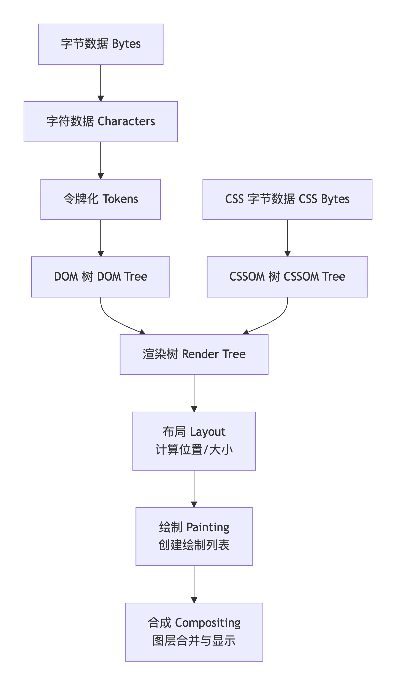

# 浏览器是如何渲染页面的

## 1、解析：从代码到模型

浏览器从网络接收HTML、CSS和JavaScript的原始字节。

**构建 DOM 树**

- 浏览器将HTML字节数据转换为指定的编码字符。
- 令牌化：将字符转换成一系列的标签（如 `<html>, <body>`， 开始标签、结束标签等）。
- 词法分析/语法分析：将这些标签构建成一棵树状结构，即 DOM。DOM是HTML文档在内存中的对象表示，它为JavaScript提供了操作页面结构和内容的接口。

**构建 CSSOM 树**

- 浏览器解析CSS（外部CSS、内部样式、行内样式），过程与构建DOM类似。
- 最终形成 CSSOM。CSSOM定义了每个DOM元素应用的样式规则，同样是一棵树状结构。CSSOM的构建是阻塞性的，因为浏览器需要知道所有元素的样式后才能进行渲染。

**执行 JavaScript**

- 当HTML解析器遇到 `<script>` 标签时，它会暂停DOM的构建。
- 浏览器加载并执行JavaScript代码（如果是外部脚本，还需先下载）。因为JavaScript可以修改DOM和CSSOM。
- 现代浏览器通常使用 预加载扫描器，在主解析器被脚本阻塞时，提前扫描并下载后续的关键资源（如图片、CSS）。
- async 和 defer 属性可以帮助我们控制脚本的加载和执行行为，减轻阻塞。

## 2、渲染：从模型到像素

解析完成后，浏览器将DOM和CSSOM结合，开始计算每个元素的视觉表现。

**构建渲染树**

- 浏览器将DOM树和CSSOM树合并成 渲染树。
- 渲染树只包含可见的DOM内容。例如，不会包含 head 元素或被CSS设置为 display: none 的元素。

**布局：** 也称为 重排。

- 浏览器计算渲染树中每个元素的几何信息：在视口内的确切位置和大小。
- 这个过程是从根节点（html）开始，递归地遍历整个渲染树来完成的。
- 布局是一个计算密集型的操作。任何可能改变元素几何属性的操作（如改变宽度、高度、字体大小，甚至调整窗口大小）都会触发整个或部分渲染树的重新布局。

**绘制：**也称为 栅格化。

- 浏览器将布局阶段计算的每个盒子转换为屏幕上的实际像素。
- 这个过程包括绘制文本、颜色、图像、边框、阴影等所有视觉部分。
- 绘制通常是在多个图层上完成的。

**合成**

- 由于页面的不同部分可能被绘制到多个图层上（例如，对于有复杂动画的元素，浏览器会将其提升到单独的图层），这些图层需要以正确的顺序合并起来，这样才能正确地显示元素的重叠关系。
- 合成 阶段就是将各个图层发送到GPU，最终在屏幕上绘制出页面的过程。
- 修改某些CSS属性（如 transform, opacity）会跳过布局和绘制阶段，直接触发合成。这通常是最高效的渲染方式，因为它由GPU直接处理，且不需要重算布局或重新绘制。

## 重排与重绘

重排：当元素的几何属性（位置、尺寸）发生变化时，浏览器需要重新计算所有受影响元素的布局。这会导致 布局 → 绘制 → 合成 整个流程的重新执行。开销最大。  
触发例子： 改变窗口大小，改变字体大小，增加/移除DOM元素，修改一个元素的宽度/高度/位置。

重绘：当元素的视觉样式改变但不影响其布局时（例如，背景色、文字颜色），浏览器会跳过布局阶段，但仍需执行 绘制 → 合成。开销比重排小，但依然有开销。  
触发例子： 改变 color, background-color, visibility。

直接合成：当改变一个既不需要布局也不需要绘制的属性时，浏览器会直接进行合成。这是最优的性能。  
触发例子： 使用CSS transform 进行移动/旋转/缩放，改变 opacity。

## 性能优化启示

1. 避免或减少重排和重绘：

- 使用 transform 和 opacity 来做动画。
- 不要频繁地读写DOM样式（尤其是会引起重排的属性），最好先批量读取，再批量写入。
- 使用 documentFragment 进行多次DOM操作后再一次性插入。

2. 优化CSS：

- 选择器尽量简单（浏览器是从右向左匹配CSS选择器的）。
- 将首屏关键CSS内联在HTML中，减少CSSOM构建的阻塞。

3. 优化JavaScript：

- 将脚本放在底部，或使用 async/defer 属性。
- 避免长时间运行的JavaScript，因为它会阻塞渲染线程。

4. 利用图层：

- 对频繁动画的元素使用 will-change: transform; 或 transform: translateZ(0); 将其提升到单独的合成层，但不要滥用，因为每个图层都需要内存和管理开销。

