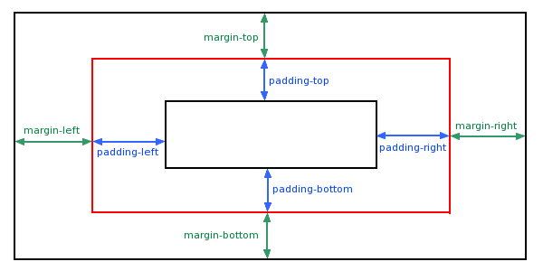

# CSS 内边距

内边距是 CSS 盒子模型中位于内容区和边框之间的部分，用于在元素内部创建空间。



## 内边距特征

- 内边距是元素内部的空间
- 内边距会增加元素的总尺寸
- 内边距区域接受元素的背景（颜色/图片）

## 内边距的语法

### 1. 单独属性

```css
div {
    padding-top: 10px;
    padding-right: 20px;
    padding-bottom: 30px;
    padding-left: 40px;
}
```

### 2. 简写属性

记忆口诀： 上 → 右 → 下 → 左（顺时针方向，从12点开始）

```css
div {
    padding: 10px;                    /* 所有边都是10px */
    padding: 10px 20px;               /* 上下10px，左右20px */
    padding: 10px 20px 30px;          /* 上10px，左右20px，下30px */
    padding: 10px 20px 30px 40px;     /* 上10px，右20px，下30px，左40px（顺时针）*/
}
```

### 3. 内边距的特殊值

```css
div {
    padding: 0;           /* 无内边距 */
    padding: 10%;         /* 相对于父元素宽度的百分比 */
    padding: 1em;         /* 相对于当前字体大小 */
    padding: inherit;     /* 继承父元素的内边距 */
    padding: initial;     /* 重置为初始值 */
    padding: unset;       /* 重置为继承值或初始值 */
}
```

## 内边距 vs 外边距

| 特性 | 内边距 | 外边距 |
| -- | ---- | ---- |
| 位置 | 内容与边框之间 | 边框与其他元素之间 |
| 背景 | 接受元素背景 | 透明，不接受背景 |
| 尺寸影响 | 增加元素总尺寸 | 不影响元素尺寸，但影响布局空间 |
| 合并现象 | 不会合并 | 垂直方向会合并 |
| 点击区域 | 增加可点击区域 | 不增加可点击区域 |

## 实用技巧与示例

### 1. 创建舒适的阅读体验

```css
.article {
    padding: 2rem;                    /* 统一的四周内边距 */
    line-height: 1.6;
}

.card {
    padding: 1.5rem 2rem;             /* 上下1.5rem，左右2rem */
    background: white;
    border-radius: 8px;
    box-shadow: 0 2px 8px rgba(0,0,0,0.1);
}
```

### 2. 按钮和交互元素

```css
.btn {
    display: inline-block;
    padding: 12px 24px;               /* 足够的点击区域 */
    background-color: #3498db;
    color: white;
    text-decoration: none;
    border: none;
    border-radius: 4px;
    transition: all 0.3s ease;
}

.btn:hover {
    background-color: #2980b9;
    padding: 12px 28px;               /* 悬停时微调内边距 */
}

.btn-small {
    padding: 8px 16px;                /* 小按钮 */
    font-size: 0.9rem;
}
```

### 3. 表单元素

```css
.input-field {
    padding: 12px 16px;               /* 舒适的输入区域 */
    border: 2px solid #bdc3c7;
    border-radius: 6px;
    font-size: 16px;                  /* 防止iOS缩放 */
    width: 100%;
}

.input-field:focus {
    border-color: #3498db;
    padding: 12px 16px;               /* 保持一致的内边距 */
}

.textarea {
    padding: 16px;
    min-height: 120px;
    resize: vertical;
}
```

### 4. 导航和菜单

```css
.nav-item {
    padding: 12px 20px;
    color: #333;
    text-decoration: none;
    transition: background-color 0.3s;
}

.nav-item:hover {
    background-color: #f8f9fa;        /* 悬停背景色会填充内边距区域 */
}

.dropdown-menu {
    padding: 8px 0;                   /* 上下8px，左右0 */
}

.dropdown-item {
    padding: 8px 16px;
    display: block;
}
```

### 5. 创建一致的间距系统

```css
/* 使用CSS变量定义内边距系统 */
:root {
    --space-xs: 0.5rem;
    --space-sm: 1rem;
    --space-md: 1.5rem;
    --space-lg: 2rem;
    --space-xl: 3rem;
}

.p-xs { padding: var(--space-xs); }
.p-sm { padding: var(--space-sm); }
.p-md { padding: var(--space-md); }
.p-lg { padding: var(--space-lg); }

.pt-sm { padding-top: var(--space-sm); }
.pr-md { padding-right: var(--space-md); }
.pb-lg { padding-bottom: var(--space-lg); }
.pl-sm { padding-left: var(--space-sm); }

.px-md { padding-left: var(--space-md); padding-right: var(--space-md); }
.py-lg { padding-top: var(--space-lg); padding-bottom: var(--space-lg); }
```

## 内边距与盒子模型

### 标准盒子模型

```css
.box-standard {
    box-sizing: content-box; /* 默认值 */
    width: 300px;
    padding: 20px;
    border: 5px solid #333;
}
/* 总宽度 = 300 + 20×2 + 5×2 = 350px */
```

### 怪异盒子模型（推荐）

```css
.box-border {
    box-sizing: border-box; /* 内边距和边框包含在width内 */
    width: 300px;
    padding: 20px;
    border: 5px solid #333;
}
/* 总宽度 = 300px (内容区 = 300 - 20×2 - 5×2 = 250px) */
```

## 响应式内边距

```css
.container {
    padding: 1rem;
}

/* 平板 */
@media (min-width: 768px) {
    .container {
        padding: 1.5rem 2rem;
    }
}

/* 桌面 */
@media (min-width: 1024px) {
    .container {
        padding: 2rem 3rem;
        max-width: 1200px;
        margin: 0 auto;
    }
}

/* 使用clamp()实现流畅的内边距 */
.fluid-container {
    padding: clamp(1rem, 5vw, 3rem); /* 最小1rem，首选5vw，最大3rem */
}
```

## 高级技巧

### 1. 使用内边距实现宽高比

```css
.aspect-ratio-16-9 {
    width: 100%;
    padding-top: 56.25%; /* 9 ÷ 16 = 0.5625 */
    position: relative;
}

.aspect-ratio-16-9 > .content {
    position: absolute;
    top: 0;
    left: 0;
    width: 100%;
    height: 100%;
}
```

### 2. 创建圆形元素

```css
.avatar {
    width: 100px;
    height: 100px;
    padding: 5px; /* 内边距作为"相框" */
    border: 3px solid #3498db;
    border-radius: 50%;
    background-color: white;
}

.avatar img {
    width: 100%;
    height: 100%;
    border-radius: 50%;
    object-fit: cover;
}
```

### 3. 悬停效果增强

```css
.icon-button {
    padding: 8px;
    border-radius: 50%;
    transition: padding 0.2s ease;
}

.icon-button:hover {
    padding: 10px; /* 悬停时略微增加内边距 */
    background-color: #f0f0f0;
}
```

### 4. 使用逻辑属性（支持多语言）

```css
/* 物理属性 */
.physical {
    padding-top: 10px;
    padding-right: 20px;
    padding-bottom: 30px;
    padding-left: 40px;
}

/* 逻辑属性（根据书写模式自动适应）*/
.logical {
    padding-block-start: 10px;    /* 块级起始方向 */
    padding-inline-end: 20px;     /* 行内结束方向 */
    padding-block-end: 30px;      /* 块级结束方向 */
    padding-inline-start: 40px;   /* 行内起始方向 */
}
```

## 常见问题与解决方案

### 问题1：内联元素的垂直内边距

```css
/* 内联元素的垂直内边距不会影响行高计算 */
span {
    padding-top: 20px;    /* 可能与其他元素重叠 */
    padding-bottom: 20px; /* 可能与其他元素重叠 */
}

/* 解决方案：改为inline-block */
span {
    display: inline-block;
    padding: 20px 10px;   /* 现在垂直内边距正常工作了 */
}
```

> ps: 不建议使用 `inline-block`元素，会出现异响不到的布局

### 问题2：表格单元格的内边距

```css
td, th {
    padding: 12px 16px;   /* 为表格单元格提供舒适的间距 */
    text-align: left;
    border-bottom: 1px solid #eee;
}
```

### 问题3：列表项的内边距

```css
ul {
    padding-left: 0;      /* 移除默认的左内边距 */
    list-style: none;
}

li {
    padding: 8px 0;       /* 只为列表项设置垂直内边距 */
    border-bottom: 1px solid #f0f0f0;
}
```
