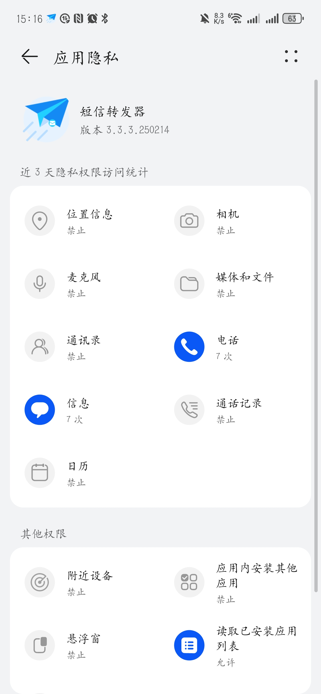
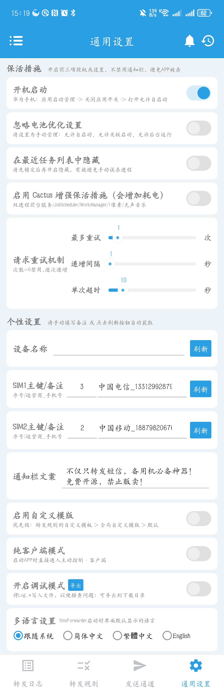

# 使用SmsForwarder转发短信

[SmsForwarder](https://github.com/pppscn/SmsForwarder)  
[SmsForwarder安卓包](https://github.com/pppscn/SmsForwarder/releases/download/v3.3.3/SmsF_3.3.3.250214_100054_universal_release.apk)

## 授予权限

安装启动App后，弹窗授权请选择允许。  
应用通知权限也别关闭，否则应用失活将监听不到短息。  
主要授予 信息、电话 两个权限：

## 通用设置

转发功能 - 转发短信广播 - 开启  

保活措施 - 开机启动/忽略电池优化设置/在最近任务列表中隐藏 - 开启  

个性设置 - SMS1主键/备注 - 刷新  
个性设置 - SMS2主键/备注 - 刷新  

> 需授权获取电话权限才能刷新获取手机号。

通知栏文案 - 可自行设定。但不可关闭应用的通知信息，否知应用会失活。

## 发送通道设置

发送通道 - + - Webhook  

通道名称/状态: web (可随意填写)/状态开启  
请求方式: POST  
Webhook Server: https://mail.go168.site/sms/sms-save?token=sms_webhook_token  
消息模板(固定，别更改): {"text":"[msg]"}  
Headers:  

- Key: Content-Type
- value: application/json
  代理设置: 无代理  

填写完，点击测试。提示请求成功即表示配置正确  
保存。  

## 转发规则设置

转发规则 - +

发送通道: 选择刚创建的发送通道（web）  
匹配卡槽: 不限卡槽  
匹配字段: 全部  
启动自定义模板: 启动  
模板内容(固定，别更改): <{{CARD_SLOT}}> <{{SMS}}> <{{FROM}}> <{{RECEIVE_TIME}}>  
启用该条转发规则: 启动  

填写完，点击测试。提示请求成功即表示配置正确  
保存。  

## 转发日志

上述配置好，接收到短信，成功转发后会在这里显示转发的短信记录

## 注意事项

1. 该APP打开后会自动后台运行并在任务栏显示运行图标，请勿强杀，退出后请重新开启，并加入到系统白名单中，并允许后台运行

2. 近期接收到部分用户反馈，SmsForwarder无法正确转发通知类短信（普通短信正常），涉及 ROM 有华为 EMUI、小米 MIUI、VIVO OriginOS、OPPO ColorOS等。国内厂商定制系统提供了验证类短信安全保护功能，导致验证码不能正常通过广播获得。以下是解决方案：
- 鸿蒙3.0：短信 > 更多 > 设置 > 验证码安全保护 > 关闭
- 华为/荣耀 EMUI：信息 > 更多 > 设置 > 高级 关闭验证码安全保护开关。
- 华为/荣耀 鸿蒙系统：桌面负一屏下拉搜索 验证码，进入设置，关闭验证码安全保护开关

[更多使用帮助](https://gitee.com/pp/SmsForwarder/wikis/pages?sort_id=4863779&doc_id=1821427)

## 短信监控中心

访问 [短信监控中心](https://go168.site/ga/sms_forward.html)

输入正确手机号，点击查询按钮。