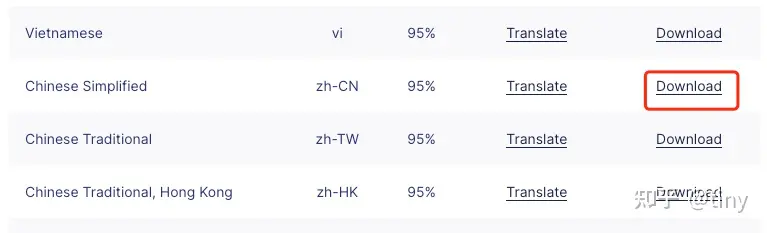

# 在vue2使用TinyMCE富文本编辑器

## 安装

```shell
yarn add tinymce
# or
npm install tinymce
```

## 拷贝 content 样式到 public 目录

只需要拷贝一个 content.css 文件，无需拷贝整个tinymce目录，避免增大git仓库的体积。

```
node_modules/tinymce/skins/ui/oxide/content.css

public/
-- tinymce/
---- skins/
------ ui/
-------- oxide/
---------- content.css
```

## 下载中文翻译文件



下载后解压到/public目录：
```
public/
-- tinymce/
---- langs/
------ zh_CN.js
---- skins/
```

## 创建组件文件

在 components 目录创建公用编辑器组件：
```
/src/components/TinyEditor/index.vue 
```

## 编写组件

```vue
<template>
    <div>
        <textarea ref="textarea"></textarea>
        <!-- <Editor :init="initCont" v-model="content" /> -->
    </div>
</template>

<script>
// import Editor from '@tinymce/tinymce-vue';
import store from '@/store';
import tinymce from 'tinymce/tinymce';
import notification from 'ant-design-vue/es/notification';

import 'tinymce/icons/default/icons';
import 'tinymce/themes/silver/theme';
import 'tinymce/plugins/link';
import 'tinymce/plugins/code';
import 'tinymce/plugins/image';
import 'tinymce/plugins/preview';
import 'tinymce/plugins/importcss';
import 'tinymce/plugins/searchreplace';
import 'tinymce/plugins/autolink';
import 'tinymce/plugins/autosave';
import 'tinymce/plugins/save';
import 'tinymce/plugins/directionality';
import 'tinymce/plugins/visualblocks';
import 'tinymce/plugins/visualchars';
import 'tinymce/plugins/fullscreen';
import 'tinymce/plugins/media';
import 'tinymce/plugins/table';
import 'tinymce/plugins/quickbars';
import 'tinymce/plugins/lists';

export default {
    name: 'EditorTinymce',
    components: {
        // Editor,
    },
    props: {
        value: {
            type: String,
            required: false,
            default() {
                return '';
            },
        },
        init: {
            type: Object,
            required: false,
            default() {
                return {};
            },
        },
    },
    data() {
        return {
            editor: null,
            // content: '',
            // initCont: {
            //     height: 250,
            //     // valid_elements: '*[*]',
            //     invalid_elements: 'noscript',
            //     language_url: '/js/langs/zh_CN.js',
            //     ski_url: '/js/skins/ui/oxide',
            //     content_css: '/js/skins/content/default/content.min.css',
            //     language: 'zh_CN',
            //     menubar: false,
            //     branding: false,
            //     toolbar_mode: 'scrolling ',
            //     toolbar:
            //         'undo redo | bold italic underline strikethrough | fontsize blocks | alignleft aligncenter alignright alignjustify | outdent indent |  numlist bullist checklist | forecolor backcolor casechange permanentpen removeformat | pagebreak | charmap | table | code ',
            //     plugins: 'code image link media table lists',
            //     image_advtab: true,
            //     image_caption: true,
            //     session_token: '',
            //     images_upload_handler: (blobInfo, progress) =>
            //         new Promise((resolve, reject) => {
            //             const xhr = new XMLHttpRequest()
            //             xhr.withCredentials = false
            //             xhr.open('POST', window.publicConfig.BASE_API + '/template_editor/upload')

            //             let token = localStorage.getItem('Access-Token')

            //             if (sessionStorage.getItem('Access-Token')) {
            //                 token = sessionStorage.getItem('Access-Token')
            //             }
            //             try {
            //                 if (token.includes('"')) {
            //                     token = JSON.parse(token)
            //                 }
            //             } catch (e) { }

            //             xhr.setRequestHeader('Access-Token', token)
            //             const storeSign = localStorage.getItem('sign_store')
            //             xhr.setRequestHeader('Store-Sign', storeSign)
            //             xhr.upload.onprogress = (e) => {
            //                 // progress(e.loaded / e.total * 100)
            //             }

            //             xhr.onload = () => {
            //                 if (xhr.status === 403) {
            //                     reject(new Error({ message: 'HTTP Error: ' + xhr.status, remove: true }))
            //                     return
            //                 }

            //                 if (xhr.status < 200 || xhr.status >= 300) {
            //                     reject(new Error('HTTP Error: ' + xhr.status))
            //                     return
            //                 }

            //                 const json = JSON.parse(xhr.responseText)

            //                 // if (!json || typeof json.location != 'string') {
            //                 //   reject('Invalid JSON: ' + xhr.responseText)
            //                 //   return
            //                 // }

            //                 resolve(json.domain + json.path)
            //             }

            //             xhr.onerror = () => {
            //                 reject(new Error('Image upload failed due to a XHR Transport error. Code: ' + xhr.status))
            //             }

            //             const formContData = new FormData()
            //             formContData.append('file', blobInfo.blob())
            //             formContData.append('noturn', true)

            //             xhr.send(formContData)
            //         }),
            // },
        }
    },
    watch: {
        value: {
            handler() {
                this.setValue(this.value);
            },
            immediate: true,
        },
    },
    create() {
    },
    activated() {
        this.tinymceFlag++
    },
    mounted() {
        let init = {
            target: this.$refs.textarea,
            height: 250,
            // valid_elements: '*[*]',
            invalid_elements: 'noscript',
            language_url: '/js/langs/zh_CN.js',
            ski_url: '/js/skins/ui/oxide',
            content_css: '/js/skins/content/default/content.min.css',
            language: 'zh_CN',
            menubar: false,
            branding: false,
            toolbar_mode: 'scrolling ',
            toolbar:
                'undo redo | bold italic underline strikethrough | fontsize blocks | alignleft aligncenter alignright alignjustify | outdent indent |  numlist bullist checklist | forecolor backcolor casechange permanentpen removeformat | pagebreak | charmap | image media link | table | code ',
            plugins: 'code image link media table lists',
            image_advtab: true,
            image_caption: true,
            session_token: '',
            images_upload_handler: (blobInfo, progress) => {
                return this.uploadImage(blobInfo, progress);
            },
        };
        if (this.$props?.init) {
            init = {
                ...init,
                ...this.$props?.init,
            }
        }
        tinymce.init(init).then(([editor]) => {
            this.editor = editor;
            this.setValue(this.value);
            editor.on('change keyup undo redo', () => {
                this.$emit('input', editor.getContent());
            });
        });
    },
    // 组件销毁前确保移除编辑器实例
    beforeDestroy() {
        this.editor?.destroy();
    },
    methods: {
        setValue(val) {
            const oldValue = this.editor?.getContent();
            if (typeof val === 'string' && val !== oldValue) {
                this.editor?.setContent(val);
            }
        },
        uploadImage(blobInfo, progress) {
            return new Promise((resolve, reject) => {
                const xhr = new XMLHttpRequest()
                xhr.withCredentials = false
                xhr.open('POST', window.publicConfig.BASE_API + '/template_editor/upload')

                let token = localStorage.getItem('Access-Token')

                if (sessionStorage.getItem('Access-Token')) {
                    token = sessionStorage.getItem('Access-Token')
                }
                try {
                    if (token.includes('"')) {
                        token = JSON.parse(token)
                    }
                } catch (e) { }

                xhr.setRequestHeader('Access-Token', token)
                const storeSign = localStorage.getItem('sign_store')
                xhr.setRequestHeader('Store-Sign', storeSign)
                xhr.upload.onprogress = (e) => {
                    // progress(e.loaded / e.total * 100)
                }

                xhr.onload = () => {
                    if (xhr.status === 403) {
                        reject(new Error({ message: 'HTTP Error: ' + xhr.status, remove: true }))
                        return
                    }

                    if (xhr.status < 200 || xhr.status >= 300) {
                        reject(new Error('HTTP Error: ' + xhr.status))
                        return
                    }

                    const json = JSON.parse(xhr.responseText)
                    console.log('json', json)

                    // 鉴权失败: 未登录
                    if (json.status === 401) {
                        store.dispatch('Logout').then(() => {
                            notification.error({
                                message: '错误',
                                description: json.message,
                                duration: 3,
                            })
                            setTimeout(() => {
                                window.location.reload()
                            }, 1200)
                        })
                        return;
                    }
                    // if (!json || typeof json.location != 'string') {
                    //   reject('Invalid JSON: ' + xhr.responseText)
                    //   return
                    // }

                    resolve(json.domain + json.path)
                }

                xhr.onerror = () => {
                    reject(new Error('Image upload failed due to a XHR Transport error. Code: ' + xhr.status))
                }

                const formContData = new FormData()
                formContData.append('file', blobInfo.blob())
                formContData.append('noturn', true)

                xhr.send(formContData)
            });
        },
    },
}
</script>
<style>
    .ant-notification {
        z-index: 2000;
    }
</style>
```

## 使用组件
```vue
<TinyEditor v-model="content"></TinyEditor>
```

## 在弹出框中使用组件或者在antd Vue的tabs组件中使用，切换tab不重新渲染问题
```vue
<TinyEditor v-if="dialogVisible" v-model="content"></TinyEditor>
```