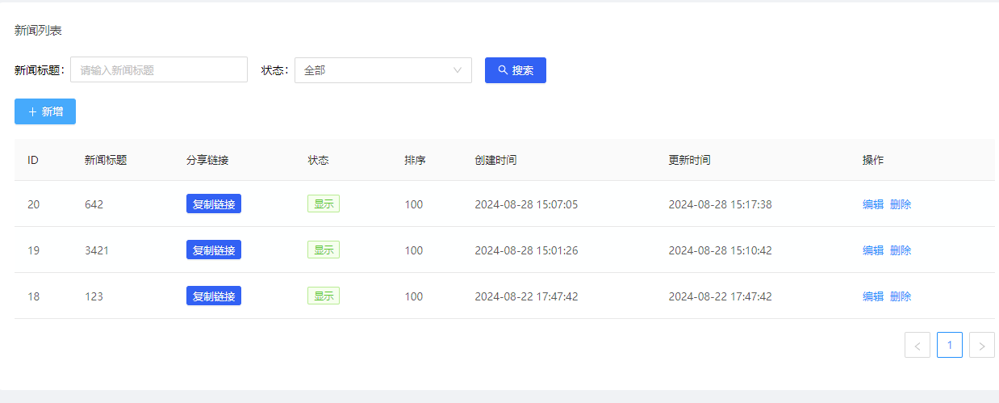
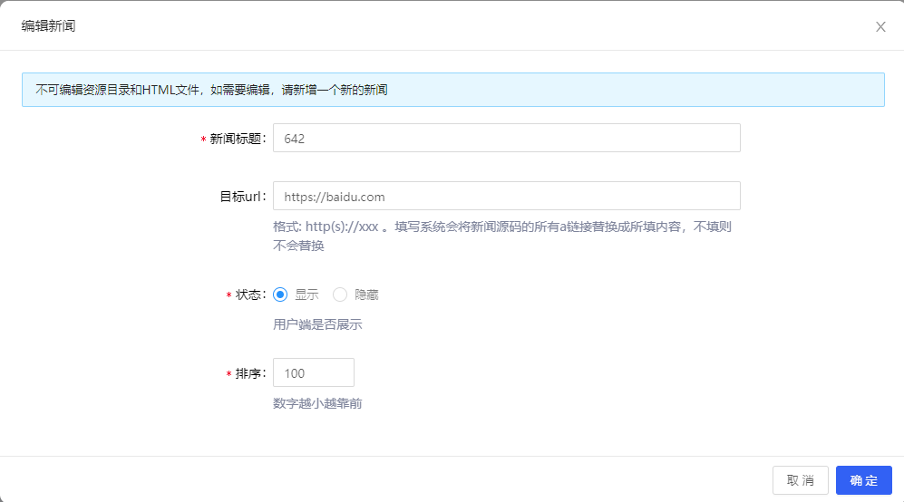

# [分布式] 浏览器保存新闻，发布到自有网站

## 需求讲解

运营想快速发布新闻，通过浏览器找到较好的新闻内容页，他们将网页保存下来(Ctrl + S)。下载后的内容基本是`index.html`文件+`index_files`文件夹。
他们想将这资源快速上传到我们自有网站上，上传同时指定所有链接跳转到他们指定的url页面。然后生产我们自己的新闻详情链接，复制链接去各大平台推广。

## 实现思路

先上传`index_files`资源目录，将所有资源上传到对象存储(如阿里云的OSS)，并返回原文件名和新文件路径；
接着上传`index.html`文件和目标url，提交表单；
服务器读取`index.html`文件并替换所有`a`标签链接地址到目标url；
服务器读取`index.html`文件并替换所有资源路径（`img/video/link/script`）一一对照对象存储新路径替换；
最后将html存入数据库中，访问新闻详情时，直接输出对应html内容即可。


## 开发环境要求

php 7.1+
框架: tp6

## 前端展示




## 代码实现

### 前端实现

前端使用react/vue + antd UI组件都行，只要实现zip文件上传和目标url输入框即可。

列表页
```vue
<template>
    <a-card :bordered="false">
        <div class="card-title">{{ $route.meta.title }}</div>
        <div class="table-operator">
            <!-- 搜索板块 -->
            <a-row class="row-item-search">
                <a-form class="search-form" :form="searchForm" layout="inline" @submit="handleSearch">
                    <a-form-item label="新闻标题">
                        <a-input v-decorator="['title']" placeholder="请输入新闻标题" />
                    </a-form-item>
                    <a-form-item label="状态">
                        <a-select v-decorator="['status', { initialValue: -1 }]">
                            <a-select-option :value="-1">全部</a-select-option>
                            <a-select-option :value="1">显示</a-select-option>
                            <a-select-option :value="0">隐藏</a-select-option>
                        </a-select>
                    </a-form-item>
                    <a-form-item class="search-btn">
                        <a-button type="primary" icon="search" html-type="submit">搜索</a-button>
                    </a-form-item>
                </a-form>
            </a-row>
            <!-- 操作板块 -->
            <div class="row-item-tab clearfix">
                <a-button v-action:add type="primary" icon="plus" @click="handleAdd">新增</a-button>
            </div>
        </div>
        <s-table ref="table" rowKey="article_id" :loading="isLoading" :columns="columns" :data="loadData"
            :pageSize="15">
            <!-- 分享链接 -->
            <span slot="shareUrl" slot-scope="text, item">
                <copy-to-clipboard :text="item?.to_url" @copy="handleCopy">
                    <a-button type="primary" size="small" :title="item?.to_url">
                        复制链接
                    </a-button>
                </copy-to-clipboard>
            </span>
            <!-- 状态 -->
            <span slot="status" slot-scope="text">
                <a-tag :color="text ? 'green' : ''">{{ text ? '显示' : '隐藏' }}</a-tag>
            </span>
            <!-- 操作项 -->
            <span slot="action" slot-scope="text, item">
                <a v-action:edit style="margin-right: 8px;" @click="handleEdit(item)">编辑</a>
                <a v-action:delete @click="handleDelete(item)">删除</a>
            </span>
        </s-table>
        <AddForm ref="AddForm" :categoryList="categoryList" @handleSubmit="handleRefresh" />
        <EditForm ref="EditForm" :categoryList="categoryList" @handleSubmit="handleRefresh" />
    </a-card>
</template>

<script>
import CopyToClipboard from 'vue-copy-to-clipboard'
import * as NewsApi from '@/api/content/news'
import { ContentHeader, STable } from '@/components'
import EditForm from './modules/EditForm'
import AddForm from './modules/AddForm'

// 表格表头
const columns = [
    {
        title: 'ID',
        dataIndex: 'news_id',
    },
    {
        title: '新闻标题',
        dataIndex: 'title',
        scopedSlots: { customRender: 'stitle' },
    },
    {
        title: '分享链接',
        dataIndex: 'page_url',
        scopedSlots: { customRender: 'shareUrl' },
    },
    {
        title: '状态',
        dataIndex: 'status',
        scopedSlots: { customRender: 'status' },
    },
    {
        title: '排序',
        dataIndex: 'sort',
    },
    {
        title: '创建时间',
        dataIndex: 'create_time',
    },
    {
        title: '更新时间',
        dataIndex: 'update_time',
    },
    {
        title: '操作',
        dataIndex: 'action',
        width: '180px',
        scopedSlots: { customRender: 'action' },
    },
]

export default {
    name: 'Index',
    components: {
        ContentHeader,
        STable,
        AddForm,
        EditForm,
        CopyToClipboard,
    },
    data() {
        return {
            expand: false,
            // 当前表单元素
            searchForm: this.$form.createForm(this),
            // 分类列表
            categoryList: [],
            // 查询参数
            queryParam: {},
            // 正在加载
            isLoading: false,
            // 表头
            columns,
            // 加载数据方法 必须为 Promise 对象
            loadData: param => {
                return NewsApi.list({ ...param, ...this.queryParam })
                    .then(response => {
                        return response.data.list
                    })
            },
        }
    },
    created() { },
    methods: {
        handleCopy(result) {
            if (result) this.$message.success('内容已复制到剪贴板', 1.5);
        },
        // 确认搜索
        handleSearch(e) {
            e.preventDefault()
            this.searchForm.validateFields((error, values) => {
                if (!error) {
                    this.queryParam = { ...this.queryParam, ...values }
                    this.handleRefresh(true)
                }
            })
        },

        /**
         * 删除记录
         */
        handleDelete(item) {
            const app = this
            this.$confirm('您确定要删除该记录吗?', '提示', {
                confirmButtonText: '确定',
                cancelButtonText: '取消',
                type: 'warning',
            }).then(() => {
                NewsApi.deleted({ newsId: item.news_id })
                    .then(result => {
                        app.$message.success(result.message, 1.5)
                        app.handleRefresh()
                    })
            })
        },

        /**
         * 新增记录
         */
        handleAdd() {
            this.$refs.AddForm.add()
        },

        /**
         * 编辑记录
         */
        handleEdit(item) {
            this.$refs.EditForm.edit(item.news_id)
        },

        /**
         * 刷新列表
         * @param Boolean bool 强制刷新到第一页
         */
        handleRefresh(bool = false) {
            this.$refs.table.refresh(bool)
        },

    },
}
</script>
<style lang="less" scoped>
.ant-card-body {
    padding: 22px 29px 25px;
}

// 筛选tab
.tab-list {
    margin-right: 20px;
}
</style>

```

**新增**
```vue
<template>
    <a-modal :title="title" :width="1000" :visible="visible" :confirmLoading="confirmLoading || assetsUploading?.length > 0" :maskClosable="false"
        :destroyOnClose="true" @ok="handleSubmit" @cancel="handleCancel">
        <a-spin :spinning="confirmLoading">
            <a-form :form="form">
                <a-form-item label="新闻标题" :labelCol="labelCol" :wrapperCol="wrapperCol">
                    <a-input v-decorator="['title', { rules: [{ required: true, min: 2, message: '请输入至少2个字符' }] }]" />
                </a-form-item>
                <a-form-item label="资源目录" :labelCol="labelCol" :wrapperCol="wrapperCol" extra="请上传资源文件夹">
                    <a-upload directory :beforeUpload="beforeUploadAssets" :customRequest="onUploadAssets"
                        v-decorator="['file', { rules: [{ required: true, message: '请选择1个资源目录上传' }] }]">
                        <a-button> <a-icon type="upload" /> 上传资源 </a-button>
                    </a-upload>
                </a-form-item>
                <a-form-item label="HTML文件" :labelCol="labelCol" :wrapperCol="wrapperCol" extra="请上传HTML文件">
                    <a-upload name="file" accept=".html,.htm" :beforeUpload="beforeUpload" :customRequest="onUpload"
                        :multiple="false" :file-list="fileList"
                        v-decorator="['file', { rules: [{ required: true, message: '请选择1个HTML文件' }] }]">
                        <a-button> <a-icon type="upload" /> 上传HTML文件 </a-button>
                    </a-upload>
                </a-form-item>
                <a-form-item label="目标url" :labelCol="labelCol" :wrapperCol="wrapperCol"
                    extra="格式: http(s)://xxx 。填写系统会将新闻源码的所有a链接替换成所填内容，不填则不会替换">
                    <a-input v-decorator="['target_url']" />
                </a-form-item>
                <a-form-item label="状态" :labelCol="labelCol" :wrapperCol="wrapperCol" extra="用户端是否展示">
                    <a-radio-group v-decorator="['status', { initialValue: 1, rules: [{ required: true }] }]">
                        <a-radio :value="1">显示</a-radio>
                        <a-radio :value="0">隐藏</a-radio>
                    </a-radio-group>
                </a-form-item>
                <a-form-item label="排序" :labelCol="labelCol" :wrapperCol="wrapperCol" extra="数字越小越靠前">
                    <a-input-number :min="0"
                        v-decorator="['sort', { initialValue: 100, rules: [{ required: true, message: '请输入至少1个数字' }] }]" />
                </a-form-item>
            </a-form>
        </a-spin>
    </a-modal>
</template>

<script>
import * as UploadApi from '@/api/upload'
import * as Api from '@/api/content/news'
import { debounce } from '@/utils/util'

export default {
    props: {
    },
    data() {
        return {
            // 上传文件大小限制
            uploadSizeLimit: 20,
            fileList: [],
            assetsList: [],
            assetsUploading: [],

            // 对话框标题
            title: '新增新闻',
            // 标签布局属性
            labelCol: {
                span: 7,
            },
            // 输入框布局属性
            wrapperCol: {
                span: 13,
            },
            // modal(对话框)是否可见
            visible: false,
            // modal(对话框)确定按钮 loading
            confirmLoading: false,
            // 当前表单元素
            form: this.$form.createForm(this),
        }
    },
    mounted() {
    },
    methods: {
        // 事件: 上传文件之前
        beforeUploadAssets(file, fileList) {
            // 显示错误提示(防抖处理)
            const showErrorMsg = debounce(this.$message.error, 20)
            // 验证文件大小
            const fileSizeMb = file.size / 1024 / 1024
            if (fileSizeMb > this.uploadSizeLimit) {
                showErrorMsg(`上传的文件大小不能超出${this.uploadSizeLimit}MB`)
                return false
            }
            // 验证文件上传数量
            if (fileList.length < 1) {
                showErrorMsg('上传的文件数量不能少于1个')
                return false
            }
            this.assetsUploading.push(true);
            return true
        },

        // 事件: 自定义上传
        onUploadAssets(info) {
            // 构建上传参数
            const formData = new FormData()
            formData.append('file', info.file)
            // 开始上传
            UploadApi.file(formData)
                .then(e => {
                    const { status, data } = e;
                    if (status === 200) {
                        if (data?.fileInfo) this.assetsList.push(data.fileInfo);
                        info.onSuccess();
                    } else {
                        info.onError();
                    }
                }).finally(() => {
                    this.assetsUploading.pop();
                })
        },
        // 事件: 上传文件之前
        beforeUpload(file, fileList) {
            // 显示错误提示(防抖处理)
            const showErrorMsg = debounce(this.$message.error, 20)
            // 验证文件大小
            const fileSizeMb = file.size / 1024 / 1024
            if (fileSizeMb > this.uploadSizeLimit) {
                showErrorMsg(`上传的文件大小不能超出${this.uploadSizeLimit}MB`)
                return false
            }
            // 验证文件上传数量
            if (fileList.length > 1) {
                showErrorMsg('一次上传的文件数量不能超出1个')
                return false
            }
            return true
        },

        // 事件: 自定义上传
        onUpload(info) {
            this.fileList = [info.file];
            setTimeout(() => {
                info.onSuccess();
            }, 1000);
        },
        /**
         * 显示对话框
         */
        add() {
            // 显示窗口
            this.visible = true
        },

        /**
         * 确认按钮
         */
        handleSubmit(e) {
            e.preventDefault()
            // 表单验证
            const { form: { validateFields } } = this
            validateFields((errors, values) => {
                // 提交到后端api
                !errors && this.onFormSubmit(values)
            })
        },

        /**
         * 关闭对话框事件
         */
        handleCancel() {
            this.visible = false
            this.form.resetFields()
        },

        /**
        * 提交到后端api
        */
        onFormSubmit(values) {
            this.confirmLoading = true
            // 构建上传参数
            const formData = new FormData()
            const _file = this.fileList[0];

            this.assetsList.forEach((item, index) => {
                formData.append(`assets[${index}]`, JSON.stringify(item))
            });

            formData.append('file', _file)
            formData.append('old_name', _file?.name)
            Object.keys(values)?.forEach(key => {
                if (key !== 'file' && values[key]) formData.append(key, values[key]);
            });

            Api.add(formData)
                .then((result) => {
                    // 显示成功
                    this.$message.success(result.message, 1.5)
                    // 关闭对话框事件
                    this.handleCancel()
                    // 通知父端组件提交完成了
                    this.$emit('handleSubmit', values)
                })
                .finally((result) => {
                    this.confirmLoading = false
                })
        },

    },
}
</script>
```

**编辑**
```vue
<template>
    <a-modal :title="title" :width="1000" :visible="visible" :confirmLoading="confirmLoading" :maskClosable="false"
        :destroyOnClose="true" @ok="handleSubmit" @cancel="handleCancel">
        <a-spin :spinning="confirmLoading">
            <a-alert message="不可编辑资源目录和HTML文件，如需要编辑，请新增一个新的新闻" type="info" style="margin-bottom: 15px;" />
            <a-form :form="form">
                <a-form-item label="新闻标题" :labelCol="labelCol" :wrapperCol="wrapperCol">
                    <a-input v-decorator="['title', { rules: [{ required: true, min: 2, message: '请输入至少2个字符' }] }]" />
                </a-form-item>
                <a-form-item label="目标url" :labelCol="labelCol" :wrapperCol="wrapperCol" extra="格式: http(s)://xxx 。填写系统会将新闻源码的所有a链接替换成所填内容，不填则不会替换">
                    <a-input v-decorator="['target_url']" />
                </a-form-item>
                <a-form-item label="状态" :labelCol="labelCol" :wrapperCol="wrapperCol" extra="用户端是否展示">
                    <a-radio-group v-decorator="['status', { initialValue: 1, rules: [{ required: true }] }]">
                        <a-radio :value="1">显示</a-radio>
                        <a-radio :value="0">隐藏</a-radio>
                    </a-radio-group>
                </a-form-item>
                <a-form-item label="排序" :labelCol="labelCol" :wrapperCol="wrapperCol" extra="数字越小越靠前">
                    <a-input-number :min="0"
                        v-decorator="['sort', { initialValue: 100, rules: [{ required: true, message: '请输入至少1个数字' }] }]" />
                </a-form-item>
            </a-form>
        </a-spin>
    </a-modal>
</template>

<script>
import pick from 'lodash.pick'
import * as Api from '@/api/content/news'

export default {
    components: {},
    props: { },
    data() {
        return {
            // 对话框标题
            title: '编辑新闻',
            // 标签布局属性
            labelCol: {
                span: 7,
            },
            // 输入框布局属性
            wrapperCol: {
                span: 13,
            },
            // modal(对话框)是否可见
            visible: false,
            // modal(对话框)确定按钮 loading
            confirmLoading: false,
            // 当前表单元素
            form: this.$form.createForm(this),

            // 当前记录ID
            newsId: null,
            // 当前记录详情
            record: {},
        }
    },
    mounted() {},
    methods: {
        /**
         * 显示对话框
         */
        edit(newsId) {
            // 显示窗口
            this.visible = true
            // 当前记录ID
            this.newsId = newsId
            // 获取当前详情记录
            this.getDetail()
        },

        // 获取当前详情记录
        getDetail() {
            this.confirmLoading = true
            Api.detail({ newsId: this.newsId })
                .then(result => {
                    // 当前记录
                    this.record = result.data.detail
                    // 设置默认值
                    this.setFieldsValue()
                })
                .finally((result) => {
                    this.confirmLoading = false
                })
        },

        /**
         * 设置默认值
         */
        setFieldsValue() {
            const { form: { setFieldsValue } } = this
            this.$nextTick(() => {
                setFieldsValue(pick(this.record, [
                    'title', 'target_url', 'sort', 'status',
                ]))
                setFieldsValue({ file: this.fileList })
            })
        },

        /**
         * 确认按钮
         */
        handleSubmit(e) {
            e.preventDefault()
            // 表单验证
            const { form: { validateFields } } = this

            validateFields((errors, values) => {
                // 提交到后端api
                !errors && this.onFormSubmit(values)
            })
        },

        /**
         * 关闭对话框事件
         */
        handleCancel() {
            this.visible = false
            this.record = {}
            this.form.resetFields()
        },

        /**
        * 提交到后端api
        */
        onFormSubmit(values) {
            this.confirmLoading = true
            values.newsId = this.newsId;
            Api.edit(values)
                .then((result) => {
                    // 显示成功
                    this.$message.success(result.message, 1.5)
                    // 关闭对话框事件
                    this.handleCancel()
                    // 通知父端组件提交完成了
                    this.$emit('handleSubmit', values)
                })
                .finally((result) => {
                    this.confirmLoading = false
                })
        },

    },
}
</script>
```

### 后端实现

**列表接口**
```php
/**
 * 文章列表
 * @return array
 * @throws \think\db\exception\DbException
 */
public function list()
{
    $model = new NewsModel;
    $list = $model->getList($this->request->param());
    $list = $list -> toArray();
    $curDomain = request() -> domain(); // 当前访问域名

    // 获取店铺域名
    $storeInfo = StoreModel::detail($this -> storeId);
    if (isset($storeInfo['domain'])) {
        $storeDomain = $storeInfo['domain'];
        // 判断店铺域名是否带有http/https 不带默认加上https
        if (!preg_match("/https?:\/\//i", $storeDomain)) $storeDomain = 'https://' . $storeDomain;
    }
    // $storeDomain = $this -> store['user']['store']['domain'];

    $domain = empty($storeDomain) ? $curDomain : $storeDomain;
    $list['data'] = array_map(function($item) use($curDomain, $domain) {
        $item['domain'] = $curDomain;
        $item['to_url'] = $domain . '/healthy/' . $item['news_id'];
        return $item;
    }, $list['data']);
    return $this->renderSuccess(compact('list'));
}
```

**新增接口**
```php
/**
 * 添加新闻
 * @return \think\response\Json
 */
public function add()
{
    // 新增记录
    $model = new NewsModel;

    // 表单提交参数
    $params = request() ->post();

    // 获取表单上传文件
    $file = request()->file('file');
    // 文件校验
    $FileValidate = new FileValidate;
    if (!$FileValidate->check(['file_html' => $file])) return $this->renderError($FileValidate->getError() ?: '添加失败');

    // 读取上传html的文件内容
    $fileContent = file_get_contents($file->getRealPath());

    // 处理assets
    $assetsParam = $params['assets'];
    $assets = [];
    $assets1 = [];
    foreach ($assetsParam as $item) {
        $obj = json_decode(htmlspecialchars_decode($item), true);
        $assets[$obj['file_name']] = $obj;
        $assets1[] = $obj;
    }

    // 根据target_url 替换全局a标签href的值
    if (!empty($params['target_url'])) {
        $fileContent = preg_replace_callback(
            '/<a([^>]*)href="([^"]+)"([^>]*)>(.*?)<\/a>/si',
            function ($matches) use ($params) {
                // 这里可以添加逻辑来处理 $matches[2]（原始href值）
                $newHref = $params['target_url'];
                return "<a{$matches[1]}href=\"{$newHref}\"{$matches[3]}>{$matches[4]}</a>";
            },
            $fileContent
        );
    }

    // 根据 assets 遍历替换html中对应的资源引用路径
    // {
    //     "storage":"local",
    //     "domain":"",
    //     "file_path":"3735/20240821/3d6bfef123a438dc71aed24b4547bfb4.jpg",
    //     "file_name":"bg1.jpg",
    //     "file_size":81936,
    //     "file_ext":"jpg"
    // }
    $domain = request() -> domain();

    $fileContent = preg_replace_callback_array(
        [
            '/<link([^>]*)href="([^"]+)"([^>]*)>/si' => function ($matches) use ($domain, $assets) {
                // 这里可以添加逻辑来处理 $matches[2]（原始值）
                $assetsUrl = $matches[2];
                $assetsNameArr = explode('/', $matches[2]);
                $assetsName = end($assetsNameArr);

                if (!empty($assets[$assetsName])) {
                    $v = $assets[$assetsName];
                    $doma = ($v['domain'] ?: $domain) . '/';
                    if ($v['storage'] == 'local') $doma .= 'uploads/';
                    $assetsUrl = $doma . $v['file_path'];
                }
                return "<link{$matches[1]}href=\"{$assetsUrl}\"{$matches[3]}>";
            },
            '/<script([^>]*)src="([^"]+)"([^>]*)>(.*?)<\/script>/si' => function ($matches) use ($domain, $assets) {
                // 这里可以添加逻辑来处理 $matches[2]（原始值）
                $assetsUrl = $matches[2];
                $assetsNameArr = explode('/', $matches[2]);
                $assetsName = end($assetsNameArr);

                if (!empty($assets[$assetsName])) {
                    $v = $assets[$assetsName];
                    $doma = ($v['domain'] ?: $domain) . '/';
                    if ($v['storage'] == 'local') $doma .= 'uploads/';
                    $assetsUrl = $doma . $v['file_path'];
                }
                return "<script{$matches[1]}href=\"{$assetsUrl}\"{$matches[3]}>{$matches[4]}</script>";
            },
            '/]*)[^\-]src="([^"]+)"([^>]*)>/si' => function ($matches) use ($domain, $assets) {
                // 这里可以添加逻辑来处理 $matches[2]（原始值）
                $assetsUrl = $matches[2];
                $assetsNameArr = explode('/', $matches[2]);
                $assetsName = end($assetsNameArr);
                if (!empty($assets[$assetsName])) {
                    $v = $assets[$assetsName];
                    $doma = ($v['domain'] ?: $domain) . '/';
                    if ($v['storage'] == 'local') $doma .= 'uploads/';
                    $assetsUrl = $doma . $v['file_path'];
                }
                return "";
            },
            '/<video[^>]*src="([^"]+)"([^>]*)>(.*?)<\/video>/si' => function ($matches) use ($domain, $assets) {
                // 这里可以添加逻辑来处理 $matches[2]（原始值）
                $assetsUrl = $matches[2];
                $assetsNameArr = explode('/', $matches[2]);
                $assetsName = end($assetsNameArr);

                if (!empty($assets[$assetsName])) {
                    $v = $assets[$assetsName];
                    $doma = ($v['domain'] ?: $domain) . '/';
                    if ($v['storage'] == 'local') $doma .= 'uploads/';
                    $assetsUrl = $doma . $v['file_path'];
                }
                return "<video{$matches[1]}href=\"{$assetsUrl}\"{$matches[3]}>{$matches[4]}</video>";
            }
        ],
        $fileContent
    );

    // 在html最后添加自定义js代码
    $fileContent .= "<script type='text/javascript'>
        const urlParamsStr = window.location.href.split('?')[1];
        const aDom = document.querySelector('a');
        let href = aDom.href;
        if (urlParamsStr) {
            if (href[href?.length - 1] == '/') href = href.slice(0, -1);
            if (href.includes('?')) href += urlParamsStr[0] == '&' ? urlParamsStr : '&' + urlParamsStr;
            else href += '?' + urlParamsStr;
        
            const allLinks = document.querySelectorAll('a');
            allLinks.forEach(function (link) {
                link.setAttribute('href', href);
            });
        }
    </script>";

    $postParam = [
        'title' => $params['title'],
        'html_content' => $fileContent,
        'assets' => json_encode($assets1),
        'sort' => $params['sort'],
        'status' => $params['status'],
        'target_url' => $params['target_url'] ?? '',
    ];

    if ($model->add($postParam)) {
        return $this->renderSuccess('添加成功');
    }
    return $this->renderError($model->getError() ?: '添加失败');
}
```

**编辑接口**
```php
/**
 * 文章详情
 * @param int $newsId
 * @return array|bool|string
 */
public function detail(int $newsId)
{
    $detail = NewsModel::detail($newsId);
    $detail['domain'] = request() -> domain();
    return $this->renderSuccess(compact('detail'));
}

/**
 * 编辑新闻
 * @param int $newsId
 * @return \think\response\Json
 */
public function edit(int $newsId)
{
    // 文章详情
    $model = NewsModel::detail($newsId);

    // 表单提交参数
    $params = request() ->post();
    $postParam = [
        'title' => $params['title'],
        'sort' => $params['sort'],
        'status' => $params['status'],
        'target_url' => $params['target_url'] ?? '',
    ];

    // 编辑不可修改资源目录和html文件，只能更改全局a标签链接地址

    $fileContent = $model['html_content'];
    // 根据target_url 替换全局a标签href的值
    if (!empty($postParam['target_url']) && $model['target_url'] != $postParam['target_url']) {
        $fileContent = preg_replace_callback(
            '/<a([^>]*)href="([^"]+)"([^>]*)>(.*?)<\/a>/si',
            function ($matches) use ($postParam) {
                // 这里可以添加逻辑来处理 $matches[2]（原始href值）
                $newHref = $postParam['target_url'];
                return "<a{$matches[1]}href=\"{$newHref}\"{$matches[3]}>{$matches[4]}</a>";
            },
            $fileContent
        );
        $postParam['html_content'] = $fileContent;
    }

    // 更新记录
    if ($model->edit($postParam)) {
        return $this->renderSuccess('更新成功');
    }
    return $this->renderError($model->getError() ?: '更新失败');
}
```

**删除接口**
```php
/**
 * 删除文章
 * @param $newsId
 * @return array
 */
public function delete(int $newsId)
{
    // 文章详情
    $model = NewsModel::detail($newsId);

    $assets = json_decode($model['assets'], true);
    if (!$model->setDelete($assets)) {
        return $this->renderError($model->getError() ?: '删除失败');
    }

    return $this->renderSuccess('删除成功');
}
```