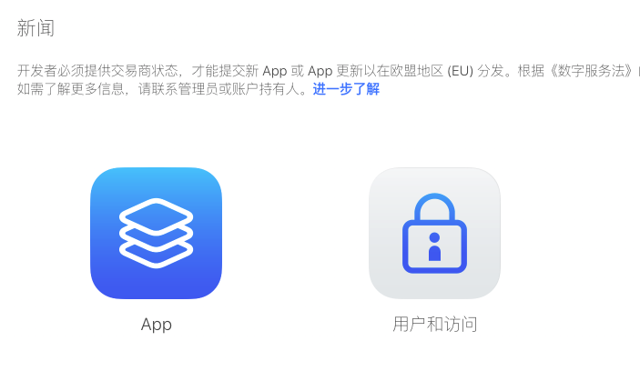
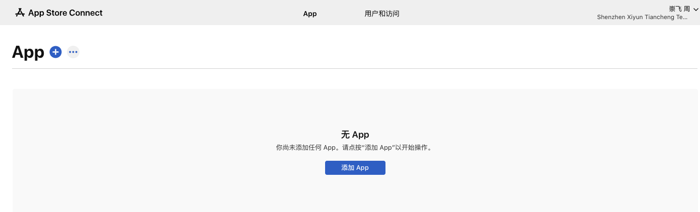
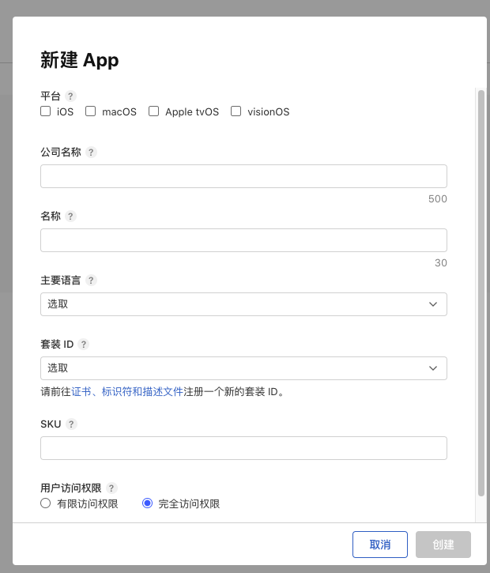

# 上架至Apple App Store

## 准备工作
- 开发者账号：确保你已经注册了Apple Developer Program，并且你的账号处于激活状态。
- App Store Connect：登录[App Store Connect](https://appstoreconnect.apple.com)，并准备好必要的信息如应用名称、描述、关键词、支持URL等。
- 应用程序图标和截图：按照Apple的要求准备不同尺寸的应用程序图标和截图。
- 隐私政策：根据Apple的规定，你需要提供一份隐私政策链接。

## 配置App Store Connect
- 在App Store Connect中创建一个新的应用项目，填写所有必要的元数据信息（如名称、描述、类别等）。
- 确保在“定价与销售范围”部分选择了你的应用将在哪些国家或地区销售。
- 上传你的应用图标、屏幕截图以及添加至少一个演示视频（可选但推荐）。

## 上传ipa文件
使用Xcode或者Application Loader来上传你的.ipa文件。如果你使用的是最新版本的Xcode，可以通过Xcode直接上传：
- 打开Xcode，选择Window > Organizer。
- 在Organizer窗口中，选择你的应用和构建版本，然后点击"Distribute App"。
- 按照提示选择App Store分发方式，并完成ipa文件的上传。

## 提交审核
- 在App Store Connect中，前往你的应用页面，找到“1.0 准备提交”部分，确保所有必填字段都已填写完毕。
- 当一切就绪后，点击“提交以供审核”。

## 审核过程
- 提交后，Apple会审查你的应用，这个过程通常需要几天时间。如果期间有任何问题（例如违反App Store指南），你会收到通知进行修正。

## 发布
- 审核通过后，你可以选择手动发布应用，或者设置为自动发布。一旦发布，你的应用就会在App Store上线，用户可以下载它了。

## 图片

