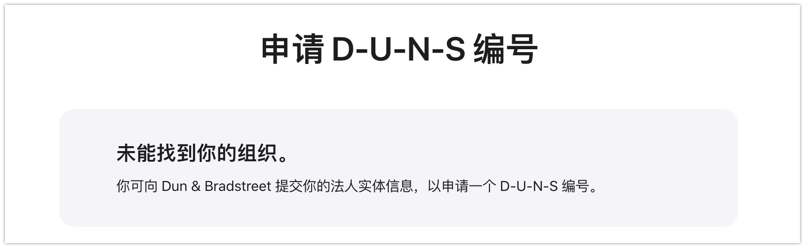
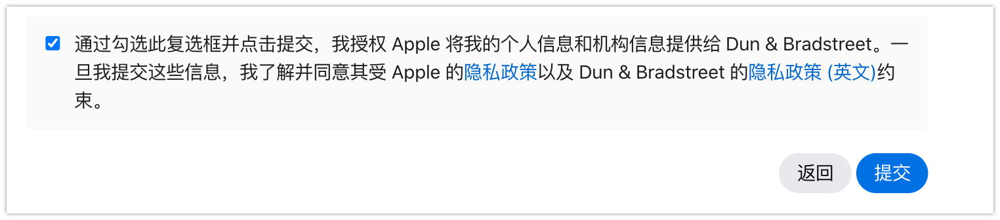
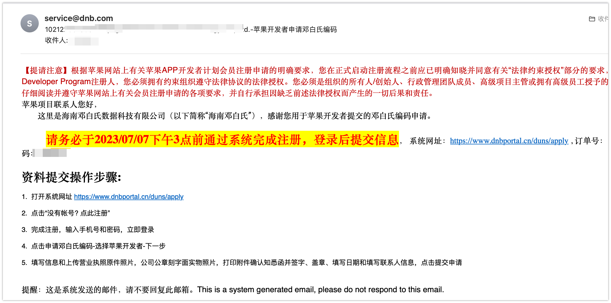

# 邓白氏编码

官方介绍：

> D-U-N-S 编号是一组唯一的九位数，用于根据具体位置识别企业实体。D-U-N-S 编号由 Dun & Bradstreet (D&B) 进行分配和维护，广泛用作标准的企业识别码。
> 作为你注册 Apple Developer Program 或 Apple Developer Enterprise Program 时验证流程的一部分，D-U-N-S 编号会被用于检查你所在组织的身份和法人实体状态。虽然许多类型的企业都能获得 D-U-N-S 编号，但你的企业必须被确认为法人实体 (如大型企业、有限合伙或有限责任公司)，才能签订 Apple Developer Program 协议的法律条款和义务。不接受 DBA、虚构公司、商号和分公司。
> 公司和教育机构必须提供为其法人实体注册的 D-U-N-S 编号。对于政府组织，D-U-N-S 编号则是可选信息。如果你以个人身份注册，则无需 D-U-N-S 编号。

## 申请步骤

### 1、查看 D&B 是否给企业分配过邓白氏编码，否则去申请

[查看网站](https://idmsa.apple.com/IDMSWebAuth/signin?appIdKey=891bd3417a7776362562d2197f89480a8547b108fd934911bcbea0110d07f757&path=%2Fenroll%2Fduns-lookup%2F&rv=1#!/search)
> 如果没有登录苹果开发者，需进行登录。

通过填写详细的组织信息（信息都是英文格式）查询。

查询结果未找到组织，才会有申请入口出现。

点击提交申请后会提示，信息正在处理，然后就是等待收确认电子邮件的过程。

当然，也可能 Dun & Bradstreet 可能已向你分配该编号 通过邮件直接发送给你

### 2、申请完等待确认邮件

邮件内容：

>发件人: donotreply@iresearch.dnb.com Thank you for your inquiry . Your inquiry has been assigned Tracking ID #xx . We will notify you through email as soon as the resolution(s) on your inquiry are complete.
Case Number(s): 0 Submitted Date/Time: XX, 2023, Business name: Beijing XX Technology Co., Ltd. Location: Beijing Requester's Own Request Key: XXX Concern categories: Add business - Mini Inquiry - Identity Data Only
Sincerely, D&B iResearch Team
Please do not respond to this message. This is a system generated email.

申请完之后你需要联系公司的行政准备一下公司的营业执照，还有公章，接下来收到D&B 的邮件后，会要求在一天左右的时间提供这些信息。

### 3、再次等待邮件并开始准备资料提交审核

### 4、等待审核完成

邓白氏后台的申请状态已经变为可交付，然后也能看到邓白氏编码信息
